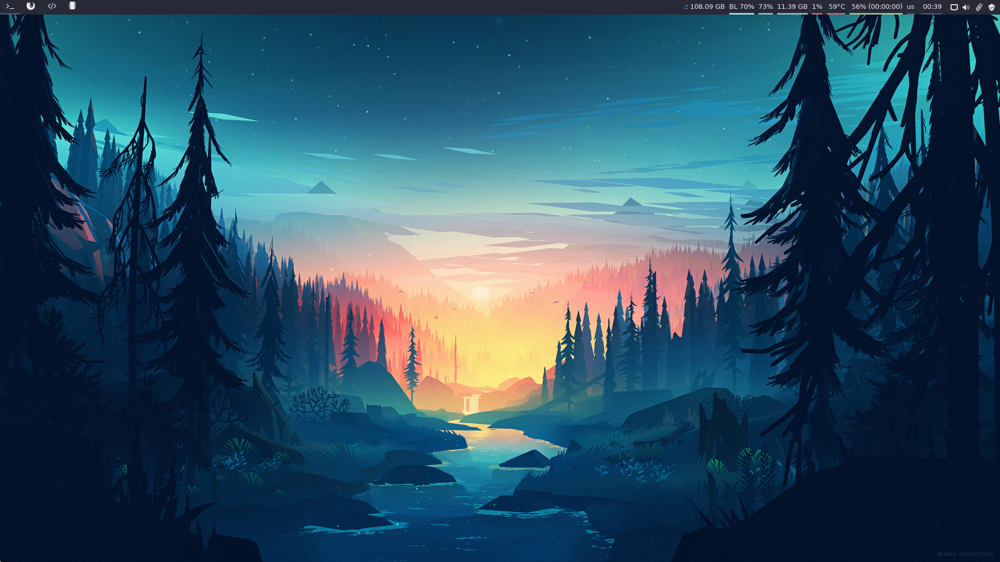
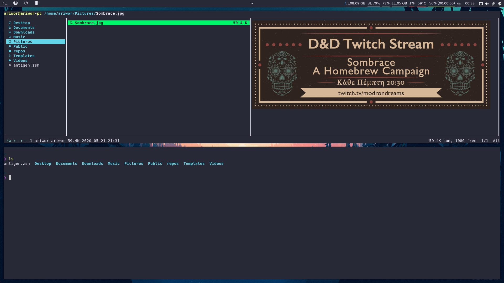
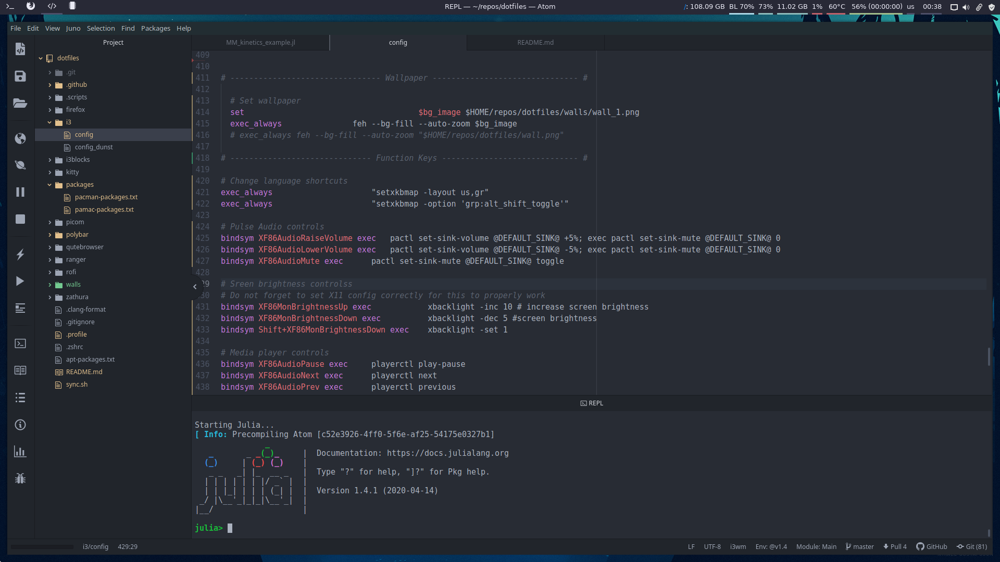

# Dotfiles

A functional and beautified `i3wm` config for programming, studying and browsing, made primarily for `arch` based distros (Manjaro, Arch).

**Note:** A brief guide (& tips) to Manjaro and i3wm can also be found in the end.

## Installation

To use the setup right away, the `sync.sh` file will come in handy.

- Create a `repos` folder in your home directory
- Clone this repository inside `repos`
- Run the script

```bash
$ cd $HOME
$ mkdir repos
$ cd repos
$ git clone https://github.com/Ariwor/dotfiles
$ cd dotfiles
$ bash sync.sh
```

Now your settings are symlinked in the respective directories and you can edit everything within `dotfiles` folder. The script will also install the below applications necessary for the setup to function properly.

## Prerequisites

Some of the base packages installed with the execution of sync script:
```
rofi
feh
polybar
kitty
firefox
ranger
playerctl
maim
zathura
zathura-pdf-mupdf
adobe-source-code-pro-fonts
```

# Screens

_Based on/inspired by `github/stavrosfil`_





# Newbie guide & tips

A brief guide, together with a list of common problems (& solutions) encountered by beginners, during Manjaro setup and `i3wm` configuration.

**Dual-boot Manjaro/Windows 10**

* Download Manjaro i3 edition from [here](https://manjaro.org/download/#i3).
* There is an excellent dual-boot step-by-step guide [here](https://forum.manjaro.org/t/howto-dual-boot-manjaro-windows-10-step-by-step/52668).
* Consider your free disk space before separating ```root``` and ```/home``` partitions.
* For swap partition size make sure to check [this](https://itsfoss.com/swap-size/).
* Make sure to update your packages, by running:
`
sudo pacman -Syu
`

**Audio issues**

* First thing you should run out of the box is:
`
sudo pacman -S pulseaudio
`

**Nvidia graphics & screen tearing**
* Install Nvidia drivers and configure Nvidia settings by following this [guide](https://wiki.manjaro.org/index.php?title=Configure_NVIDIA_(non-free)_settings_and_load_them_on_Startup).
* In addition to the above, if you encounter screen tearing, make sure to go in the `Advanced` tab in the `X Server Display Configuration` and check:
  - [ ] Force (Full) Composition Pipeline
* To fix potential screen tearing while using `Firefox`, go to `about:config` and set `layers.acceleration.force-enabled = true` (you can read more about this issue [here](https://forum.manjaro.org/t/screen-tearing-while-scrolling-in-firefox-amd/59562) and [here](https://support.mozilla.org/en-US/questions/1232970))

**Brightness control**
* Pressing the assigned keyboard brightness keys and not affecting the screen brightness (although the brightness level values in the status bar change) is a commonly encountered issue (e.g. [here](https://askubuntu.com/questions/935585/nvidia-backlight-brightness-problem)).
* A fix that worked for me is described [here](https://askubuntu.com/questions/476664/cannot-change-backlight-brightness-ubuntu-14-04) and is the following:

  1. Open `/etc/default/grub` with your favorite editor:
  ```
  sudo atom /etc/default/grub
  ```
  2. Add `video.use_native_backlight=1` here (inside `""`):
  ```
  GRUB_CMDLINE_LINUX_DEFAULT=""
  ```
  3. Save & exit
  4. Run:
  ```
  sudo update-grub
  ```
  5. Restart i3


  **Workspace icons in the status bar**

  * First you need to install the [awesome](https://github.com/gabrielelana/awesome-terminal-fonts) symbols, by running:
  `
  sudo pacman -S awesome-terminal-fonts
  `
  * Browse for icons [here](https://fontawesome.com/) and copy the _Unicode  Glyph_ from the ones you like in the i3 config file.

**Lock- & Login- screen**
* Install and configure `betterlockscreen` by following the instructions [here](https://github.com/pavanjadhaw/betterlockscreen).
* If you want to keep `set $mode_system` in your i3 config, add a `betterlockscreen` option (e.g. `betterlockscreen -l dim`) instead of `blurlock` in the `/usr/bin/i3exit` file.
* To change your login screen, use `lightdm-settings` and edit the "Background" option.
